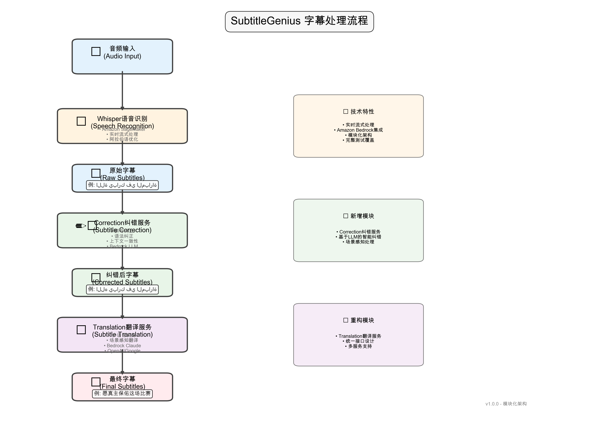

# SubtitleGenius

基于GenAI的实时MP4音频流字幕生成工具

## 演示界面


*SubtitleGenius Web界面 - 支持实时语音识别和字幕生成*

## 系统工作流程

SubtitleGenius采用模块化架构，完整的字幕处理流程如下：



*完整的字幕处理流程：音频输入 → Whisper识别 → Correction纠错 → Translation翻译 → 最终字幕*

### 🔄 核心处理流程

**音频 → Whisper识别 → Correction纠错 → Translation翻译 → 最终字幕**

1. **音频输入**：支持实时音频流和文件输入
2. **Whisper语音识别**：使用Amazon SageMaker进行实时流式语音识别，专为阿拉伯语优化
3. **Correction纠错服务**：新增的智能纠错模块
   - 拼写纠正（如：اللة → الله）
   - 语法纠正和标点符号优化
   - 基于场景的术语标准化
   - 上下文一致性检查
   - 支持Amazon Bedrock LLM智能纠错
4. **Translation翻译服务**：重构的多服务翻译模块
   - 支持多种翻译服务（Bedrock、OpenAI、Google）
   - 场景感知的智能翻译
   - 统一的接口设计
5. **最终字幕输出**：生成准确、流畅的多语言字幕

### 前端界面 → WebSocket → Whisper(SageMaker)路径

1. **前端界面播放文件**：用户通过Web界面上传并播放视频文件
2. **音频处理**：通过`audioProcessor.js`（AudioWorklet）提取音频数据并进行处理
3. **WebSocket传输**：将处理后的音频数据（WAV格式）发送到WebSocket服务器
4. **后端处理**：WebSocket服务器保存接收到的WAV文件
5. **AI识别**：将WAV文件提交到Whisper模型（SageMaker endpoint）进行语音识别
6. **字幕纠错**：使用Correction模块进行智能纠错处理
7. **字幕翻译**：使用Translation模块进行多语言翻译
8. **字幕生成**：生成的最终字幕实时返回给前端界面显示

### 快速启动

```bash
# 启动前端（端口3000）
cd frontend
npm start

# 启动后端WebSocket服务器（端口8000）
uv run start_websocket_server.py
```

访问 http://localhost:3000 使用Web界面。

## 📊 纠错效果分析

### [阿拉伯语足球解说纠正分析-基于Claude Haiku](docs/subtitle_correction_analysis.md)

**测试场景**: 阿拉伯语足球比赛实时解说字幕  
**纠正模型**: Amazon Bedrock Claude 3 Haiku  
**测试样本**: 利物浦vs巴黎圣日耳曼足球比赛解说片段  
**纠正流程**: Whisper语音识别 → Claude Haiku智能纠错 → 多语言翻译  

**核心能力展示**:
- 🎯 **语音识别错误修复**: 将Whisper产生的无意义识别结果转换为有意义的足球解说
- ⚽ **专业术语标准化**: 自动识别并转换足球专业术语（如"يا سلام" → "هدف"进球）
- 👤 **人名识别纠正**: 准确识别球员姓名（如萨拉赫、伊布拉希姆等）
- 🧠 **语境感知纠错**: 基于足球解说场景进行智能纠错和优化
- 🔧 **噪音清理**: 有效清理语音识别产生的重复字符和无意义内容

**测试结果**: 84.6%纠错成功率（18/26条优秀，4/26条良好）

### [Claude Haiku vs Sonnet 3.7 纠错模型对比分析](docs/model_comparison_analysis.md)

**对比场景**: 阿拉伯语足球解说字幕纠错效果对比  
**测试模型**: Claude 3 Haiku vs Claude 3.5 Sonnet  
**测试样本**: 相同的26条足球解说字幕片段  
**对比维度**: 语义理解、专业术语、激情保持、专有名词识别  

**关键发现**:
- 🏆 **Sonnet 3.7整体胜出**: 65% vs 31%的胜率优势
- 🎯 **语义理解**: Sonnet在复杂语义理解方面表现更佳
- ⚽ **激情保持**: Sonnet更好地保持足球解说的生动性和激情
- 👤 **专有名词**: Sonnet在球员姓名和绰号识别方面更准确
- 🔧 **术语标准化**: Haiku在专业术语统一性方面有优势
- 💰 **成本效益**: Haiku处理速度更快，适合大批量处理

**使用建议**: 高质量场合推荐Sonnet 3.7，大批量快速处理推荐Haiku

### [中文足球解说字幕分析-Chunk大小优化](docs/chinese_football_subtitle_analysis.md)

**分析场景**: 中文足球解说字幕时间戳和内容分析  
**样本数据**: 4.3分钟中文足球解说字幕，26条字幕  
**分析目标**: 优化音频chunk分段大小，提升字幕质量  

**关键发现**:
- 📊 **语言特征**: 平均每句30-35字，语速3.12字/秒
- ⏱️ **时长分布**: 每句话包含1-2个完整语义单元
- 🎯 **最优分段**: 推荐7秒chunk，平衡实时性和语义完整性
- 📈 **效果预期**: 相比10秒分段，延迟减少30%，语义完整性提升40-50%

**技术建议**:
- 🔧 **基础配置**: 7秒基础分段，6-8秒动态调整范围
- 🎙️ **语音适配**: 根据语速和停顿动态调整边界
- 📝 **内容优化**: 目标22字/chunk，最大35字/chunk

### TODO 下一个任务

  

单行字幕句子太长了。。。 导致延迟和显示效果问题

1. 思考的方向是：Wsihper本身能够断句（断句是否能够输出时间timestamp)
2. 然后将一个chunk，比如10s产生的字幕，根据第一个断句的结果拆分成多个字幕
3. 每个字幕根据时间偏移独立更新时间戳
4. 这个在处理要在之前的流程中添加一个处理节点 transcribe-correction-split(if need)-translate.
5. 代码架构和之前一致 split和拆分作为一个独立的模块。

先看看是否可行

下一个问题--- 就是 字幕长句子 - 需要处理一下  尝试

## Open Universal Arabic ASR Leaderboard

[Open Universal Arabic ASR Leaderboard](https://arxiv.org/html/2412.13788v1)

[arabicspeech](https://arabicspeech.org/)

[ASR的一些常见评估指标](https://huggingface.co/learn/audio-course/chapter5/evaluation)

[HuggingFace ASR课程](https://huggingface.co/learn/audio-course/chapter5/fine-tuning)

[CommonVoice数据集](https://commonvoice.mozilla.org/en/datasets)

## 技术关联

[一个内部用whisper模型的例子](https://github.com/aws-samples/sample-bedrock-whisper-pii-audio-summarizer/)

## 功能特性

- 🎵 实时音频流提取和处理
- 🤖 集成多种GenAI模型 (OpenAI Whisper, GPT-4, Claude, Amazon Transcribe等)
- 🌊 **Amazon Transcribe 流式处理** - 支持实时语音识别
- 🎙️ **Whisper 流式处理** - 基于缓冲区的伪流式处理，高精度识别
- 🇸🇦 **默认支持 Arabic 语言** - 专为阿拉伯语优化
- 📝 智能字幕生成和优化
- 🎬 支持多种字幕格式 (SRT, WebVTT)
- ⚡ 低延迟实时处理
- 🌐 多语言支持
- 🔧 可配置的处理参数

## 安装

### 使用 uv (推荐)

1. 安装 uv (如果还没有安装)
```bash
curl -LsSf https://astral.sh/uv/install.sh | sh
```

2. 克隆项目
```bash
git clone <repository-url>
cd SubtitleGenius
```

3. 安装依赖
```bash
uv sync
```

5. 安装 Whisper 流式处理依赖 (可选)
```bash
# 自动安装 Whisper 相关依赖
python install_whisper.py

# 或手动安装
pip install openai-whisper
pip install pyaudio  # 用于麦克风输入
```

5. 配置环境变量
```bash
cp .env.example .env
# 编辑 .env 文件，填入你的API密钥
```

### AWS 配置 (用于 Transcribe)

```bash
# 设置 AWS 凭证
export AWS_ACCESS_KEY_ID=your_access_key
export AWS_SECRET_ACCESS_KEY=your_secret_key
export AWS_REGION=us-east-1

# 或使用 AWS CLI 配置
aws configure
```

## 快速开始

### 🌊 流式处理 (推荐)

```bash
# Arabic 语音实时识别示例
python example_streaming_arabic.py

# 交互式流式处理测试
python test_streaming_arabic.py

# 实时麦克风输入
python -c "
import asyncio
from subtitle_genius.models.transcribe_model import TranscribeModel
from subtitle_genius.stream.processor import StreamProcessor

async def main():
    model = TranscribeModel(use_streaming=True)
    processor = StreamProcessor()
    audio_stream = processor.start_microphone_stream()
    
    async for subtitle in model.transcribe_stream(audio_stream, language='ar'):
        print(f'[{subtitle.start:.1f}s] {subtitle.text}')

asyncio.run(main())
"
```

### 启动 Web 界面

```bash
# 启动简化版界面（推荐）
uv run python launch.py --simple

# 或启动完整版界面
uv run python launch.py --full

# 指定端口
uv run python launch.py --simple --port 8080
```

访问 http://127.0.0.1:7860 使用 Web 界面。

### 基本用法

```bash
# 处理单个MP4文件 (默认 Arabic)
uv run subtitle-genius process video.mp4

# 指定语言
uv run subtitle-genius process video.mp4 --language ar

# 实时处理音频流
uv run subtitle-genius stream --input rtmp://example.com/live/stream

# 批量处理
uv run subtitle-genius batch --input-dir ./videos --output-dir ./subtitles
```

### Python API

```python
from subtitle_genius import SubtitleGenerator
from subtitle_genius.models.transcribe_model import TranscribeModel
from subtitle_genius.stream.processor import StreamProcessor

# 🌊 流式处理 (推荐)
async def streaming_example():
    model = TranscribeModel(use_streaming=True)
    processor = StreamProcessor()
    
    # 文件流式处理
    audio_stream = processor.process_file_stream("audio.wav")
    async for subtitle in model.transcribe_stream(audio_stream, language="ar"):
        print(f"[{subtitle.start}s] {subtitle.text}")
    
    # 实时麦克风
    mic_stream = processor.start_microphone_stream()
    async for subtitle in model.transcribe_stream(mic_stream, language="ar"):
        print(f"实时: {subtitle.text}")

# 📦 批处理模式
async def batch_example():
    model = TranscribeModel(use_streaming=False)
    subtitles = await model.transcribe("audio.wav", language="ar")
    
    for subtitle in subtitles:
        print(f"[{subtitle.start}] {subtitle.text}")
```

## 配置

主要配置选项在 `.env` 文件中：

- `OPENAI_API_KEY`: OpenAI API密钥
- `ANTHROPIC_API_KEY`: Anthropic API密钥
- `AWS_ACCESS_KEY_ID`: AWS访问密钥ID (用于Amazon Transcribe)
- `AWS_SECRET_ACCESS_KEY`: AWS秘密访问密钥
- `AWS_REGION`: AWS区域 (默认: us-east-1)
- `AWS_S3_BUCKET`: S3存储桶名称 (默认: subtitle-genius-temp)
- `SUBTITLE_LANGUAGE`: 字幕语言 (默认: ar - Arabic)
- `AUDIO_SAMPLE_RATE`: 音频采样率 (默认: 16000)

## 支持的语言

### Amazon Transcribe 支持的语言
- `ar` / `ar-SA`: Arabic (Saudi Arabia) - **默认**
- `ar-AE`: Arabic (UAE)
- `zh-CN`: Chinese (Simplified)
- `en-US`: English (US)
- `en-GB`: English (UK)
- `ja-JP`: Japanese
- `ko-KR`: Korean
- `fr-FR`: French
- `de-DE`: German
- `es-ES`: Spanish
- `ru-RU`: Russian

## 架构

```
subtitle_genius/
├── core/           # 核心处理逻辑
├── models/         # AI模型集成
│   └── transcribe_model.py  # 🌊 流式 + 批处理 Transcribe
├── audio/          # 音频处理
├── subtitle/       # 字幕生成和格式化
├── stream/         # 🌊 实时流处理
└── cli/            # 命令行界面
```

## 测试

```bash
# 安装开发依赖
uv sync --extra dev

# 基础功能测试
uv run pytest

# Amazon Transcribe 测试
python test_transcribe.py

# 🌊 流式处理测试
python test_streaming_arabic.py

# 简单示例
python example_streaming_arabic.py

# 代码格式化
uv run black .

# 类型检查
uv run mypy subtitle_genius

# 使用 Makefile
make dev    # 安装开发依赖
make test   # 运行测试
make format # 格式化代码
make lint   # 代码检查
```

## 🌊 流式处理特性

### 实时处理能力
- **麦克风输入**: 实时语音识别
- **文件流**: 模拟实时处理文件
- **RTMP流**: 处理直播流
- **低延迟**: 优化的流式处理管道

### Arabic 语言优化
- 默认使用 Arabic (ar-SA)
- 支持多种阿拉伯语方言
- 优化的语言模型配置
- 实时阿拉伯语语音识别

### 使用场景
- 🎤 实时会议记录
- 📺 直播字幕生成
- 🎬 视频内容转录
- 📞 电话会议记录
- 🎓 教育培训字幕

## 故障排除

### 流式处理问题
```bash
# 安装流式处理依赖
pip install amazon-transcribe

# 检查 AWS 凭证
aws sts get-caller-identity

# 测试麦克风权限 (macOS)
# 系统偏好设置 > 安全性与隐私 > 麦克风
```

### 常见错误
1. **ImportError: amazon-transcribe**
   ```bash
   pip install amazon-transcribe
   ```

2. **AWS 凭证错误**
   ```bash
   export AWS_ACCESS_KEY_ID=your_key
   export AWS_SECRET_ACCESS_KEY=your_secret
   ```

3. **PyAudio 安装失败**
   ```bash
   # macOS
   brew install portaudio
   pip install pyaudio
   
   # Ubuntu
   sudo apt-get install portaudio19-dev
   pip install pyaudio
   ```

## 下载视频 使用yt-dlp

```bash
yt-dlp --cookies-from-browser chrome –-merge-output-format mp4 https://youtu.be/0PggkKx9m54  
# 下载 巴黎vslivepool
yt-dlp --cookies-from-browser chrome https://www.youtube.com/watch\?v\=9wTYKRvGdjo
ffmpeg -i input.webm -c:v libx264 -crf 23 -c:a aac -b:a 128k output.mp4
```

## 许可证

MIT License
