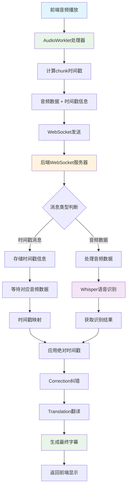
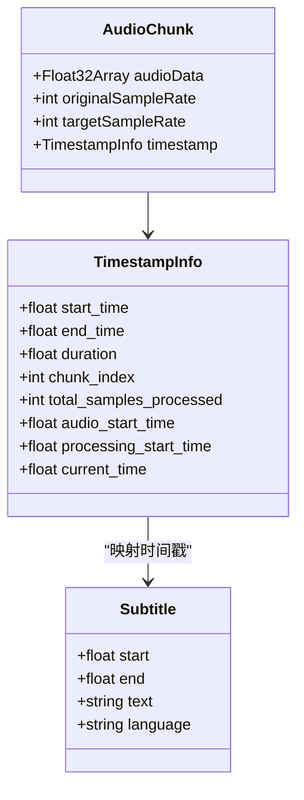
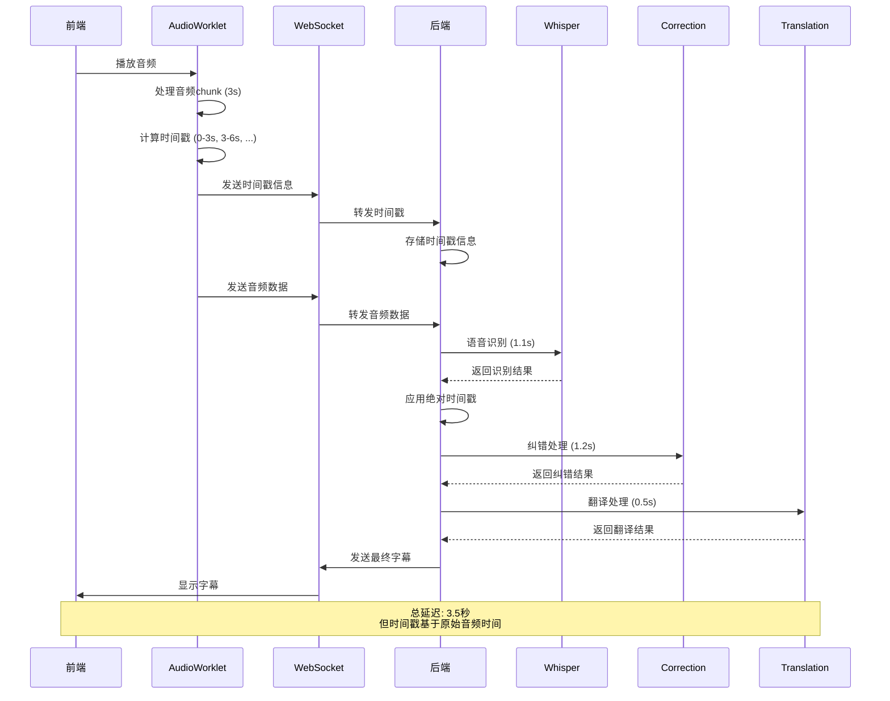
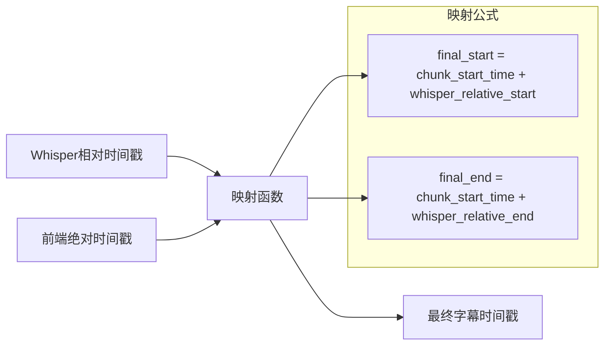

# 时间戳处理流程图

## 完整的时间戳处理流程

## 时间戳数据结构

## 处理时序图

## 关键时间点说明

| 时间点 | 说明 | 示例值 |
|--------|------|--------|
| `start_time` | chunk在音频中的起始时间 | 6.0s |
| `end_time` | chunk在音频中的结束时间 | 9.0s |
| `duration` | chunk的时长 | 3.0s |
| `chunk_index` | chunk的序号 | 2 |
| `audio_start_time` | 音频开始处理的时间戳 | AudioContext.currentTime |
| `processing_start_time` | 处理开始的时间戳 | AudioContext.currentTime |
| `current_time` | 当前处理时间戳 | AudioContext.currentTime |

## 时间戳映射逻辑

